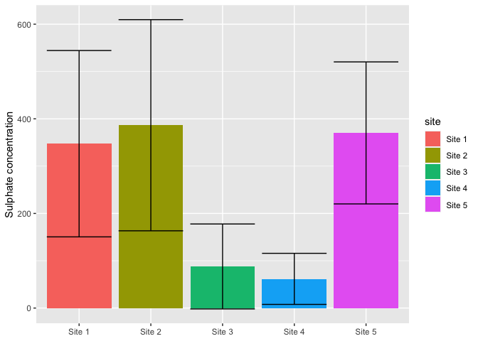
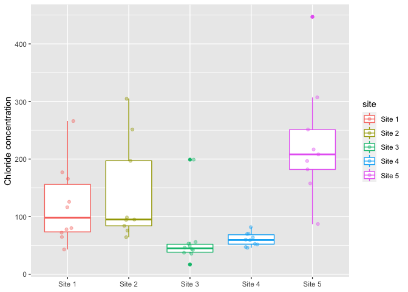
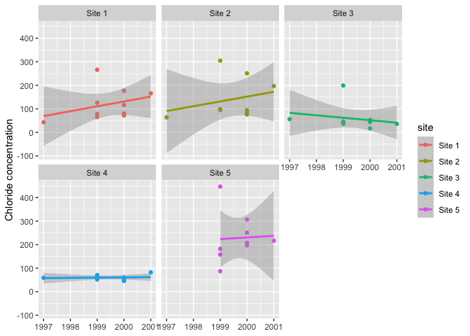

## 1. Lad data

We are going to load the required dataset of water quality measured in ditches. 


```r
dat_original <- read_csv(here("data", "ditch.csv"))
```

```
## Parsed with column specification:
## cols(
##   Site = col_character(),
##   Year = col_double(),
##   Month = col_double(),
##   Depth = col_double(),
##   pH = col_double(),
##   Conductivity = col_double(),
##   BOD = col_double(),
##   Ammoniacal_Nitrogen = col_double(),
##   Total_Oxidised_Nitrogen = col_double(),
##   Suspended_Solids = col_double(),
##   Chloride = col_double(),
##   Sulphate = col_double(),
##   Total_Calcium = col_double(),
##   Total_Zinc = col_double(),
##   Total_Cadmium = col_double(),
##   Total_Lead = col_double(),
##   Total_Nickel = col_double(),
##   Total_Phosphate = col_double()
## )
```
# 2. Data processing
 
 Let's clean the names so they fit within the tydiverse style guide
 

```r
dat <- dat_original %>% 
  clean_names()
```
 
# 3 Data summary
 

```r
sulphate_summary <- dat %>% 
  pivot_longer(cols = c(-site, -year, -month, -depth), names_to = "parameter", values_to = "measure") %>% 
  filter(parameter == "sulphate") %>% 
  group_by(site, parameter) %>% 
  summarise(mean_measure = mean(measure, na.rm = TRUE),
            sd_measure = sd(measure, na.rm = TRUE)) %>% 
  mutate(mean_measure = round(mean_measure, digits = 2),
         sd_measure = round(sd_measure, digits = 2))
```

```
## `summarise()` regrouping output by 'site' (override with `.groups` argument)
```

This following chunk is not required for the assignment, but it formats the table so it looked pretty in the `README.md`


|site   |parameter | mean_measure| sd_measure|
|:------|:---------|------------:|----------:|
|Site 1 |sulphate  |       347.40|     196.93|
|Site 2 |sulphate  |       386.44|     223.15|
|Site 3 |sulphate  |        87.90|      89.80|
|Site 4 |sulphate  |        61.70|      53.98|
|Site 5 |sulphate  |       370.22|     150.09|


# 4. plots

## 4.1 Bar chart

We will use the generated summary table to create the following bar chart


```r
sulphate_summary %>% 
  ggplot() +
  geom_col(aes(x = site, y = mean_measure, fill = site)) +
  geom_errorbar(aes(x = site, ymin = mean_measure - sd_measure, ymax = mean_measure + sd_measure)) +
  labs(x = NULL,
       y = "Sulphate concentration")
```

<!-- -->

##4.2 Box plot
 
 Now lets look at the chloride concentrations between sites
 

```r
dat %>% 
  pivot_longer(cols = c(-site, -year, -month, -depth), names_to = "parameter", values_to = "measure") %>% 
  filter(parameter == "chloride") %>% 
  ggplot() +
  geom_boxplot(aes(x = site, y = measure, colour = site)) +
  geom_jitter(aes(x = site, y = measure, colour = site), width = 0.1, alpha = 0.4) +
  labs(x = NULL,
       y = "Chloride concentration")
```

<!-- -->

##4.3 temporal points plot
 

```r
dat %>% 
  pivot_longer(cols = c(-site, -year, -month, -depth), names_to = "parameter", values_to = "measure") %>% 
  filter(parameter == "chloride") %>% 
  ggplot() +
  facet_wrap(~site) +
  geom_point(aes(x = year, y = measure, colour = site)) +
  geom_smooth(aes(x = year, y = measure, colour = site), method = "lm") +
  labs(x = NULL,
       y = "Chloride concentration")
```

```
## `geom_smooth()` using formula 'y ~ x'
```

<!-- -->
 
 

